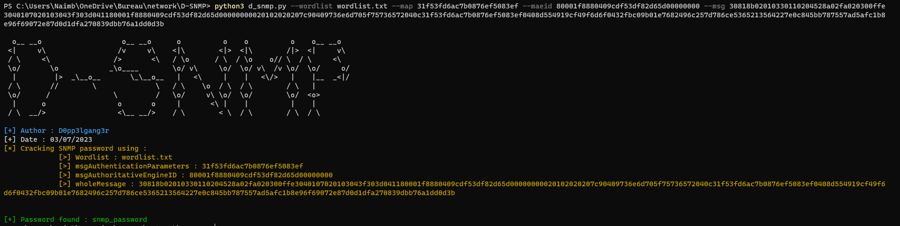

# D-SNMP
## Description EN
Based on these explanation : https://applied-risk.com/resources/brute-forcing-snmpv3-authentication. 
This tool has been made to crack the password of an SNMPv3 Authentication. 

  

## Description FR
Basé sur ces explications : https://applied-risk.com/resources/brute-forcing-snmpv3-authentication. 
L'outil a été conçu dans le but de retrouver le mot de passe d'une authentification SNMPv3. 

  

